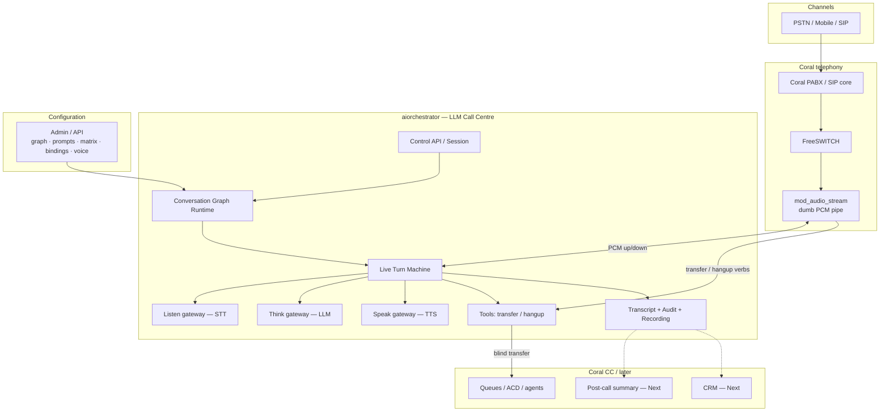
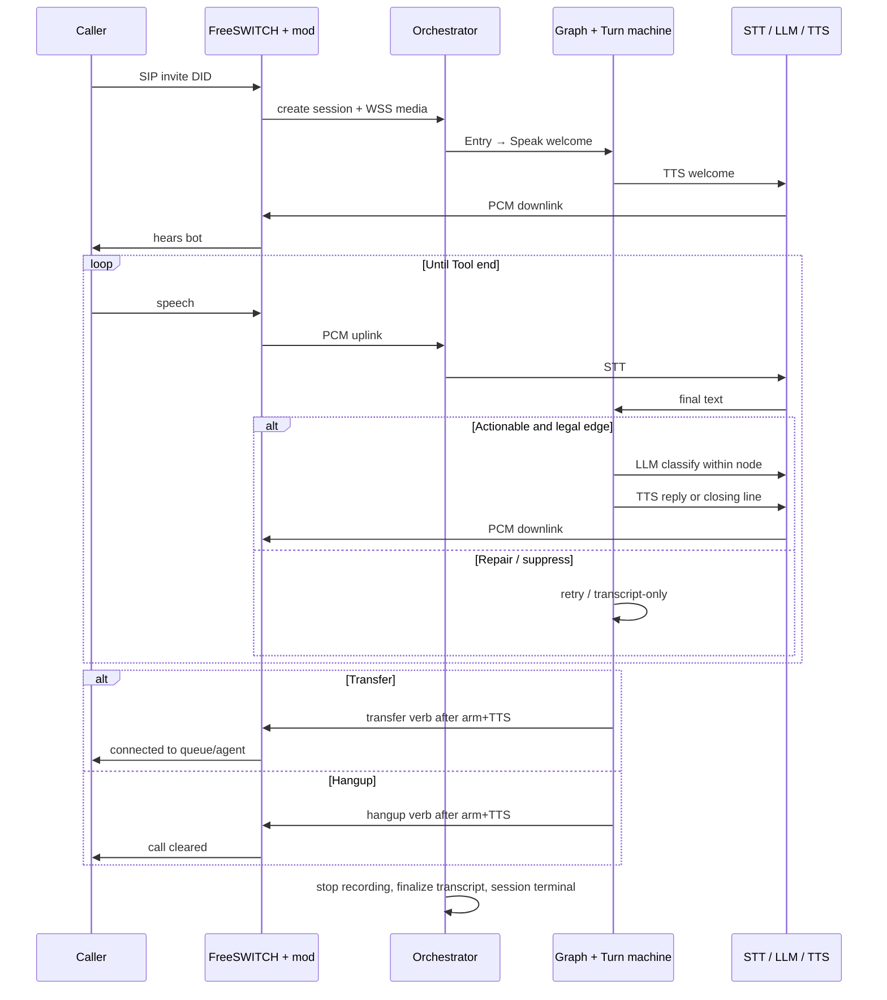
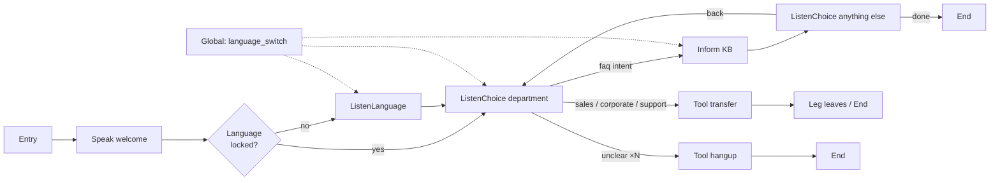
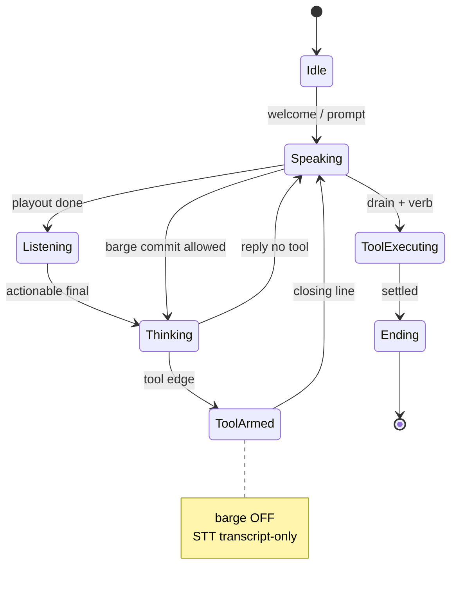
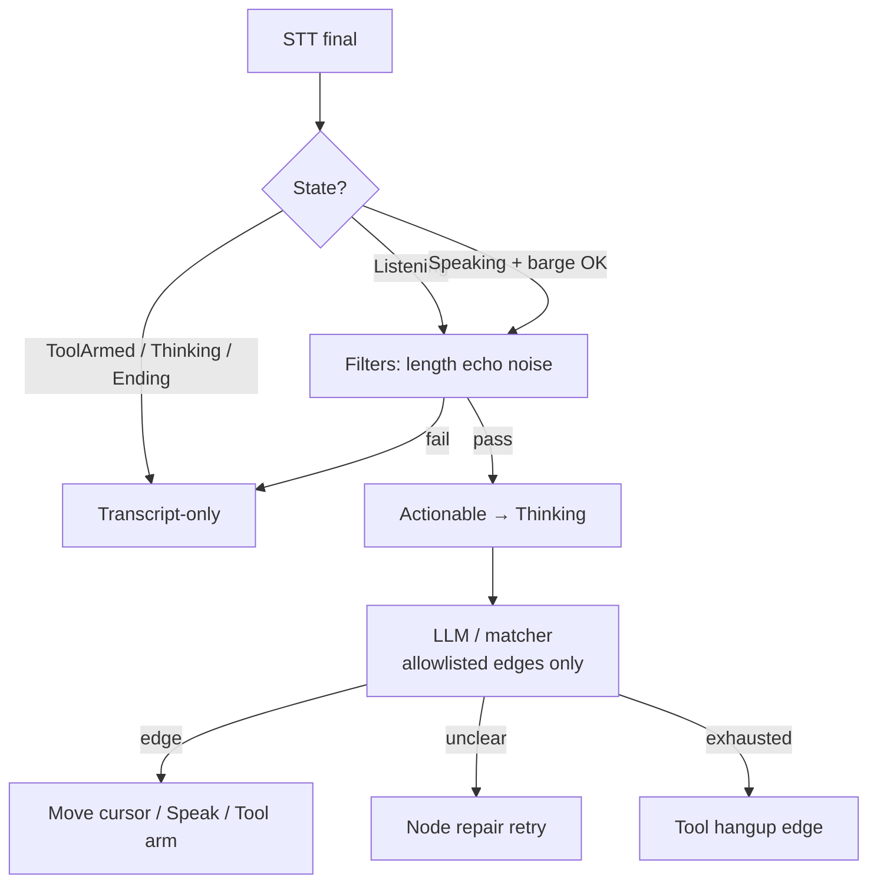
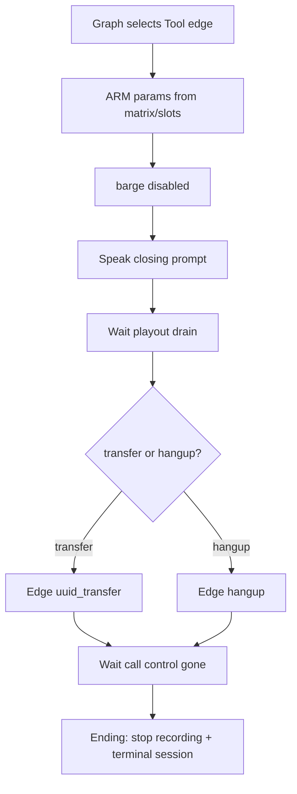
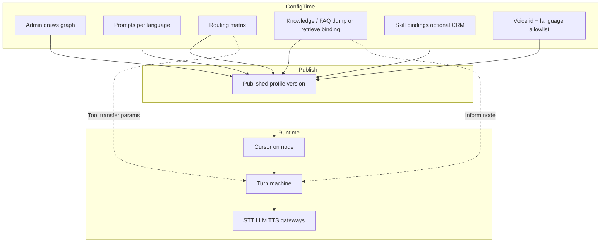
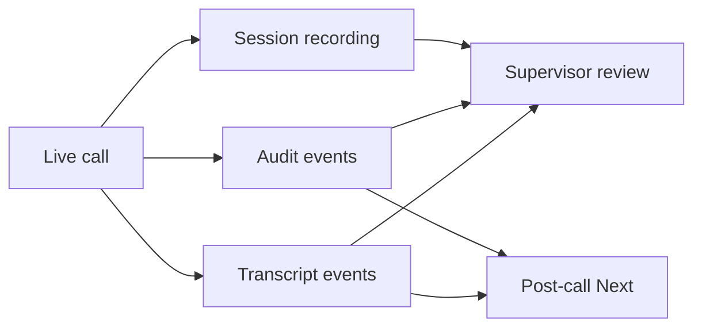

# 06 — Application flow (whole system)

This document is the **single map** of the application we are building: telephony, media, brain, tools, and evidence.  
 complementary detail: [03_BRAIN_AND_GRAPH.md](./03_BRAIN_AND_GRAPH.md), [04_LIVE_TURN_MACHINE.md](./04_LIVE_TURN_MACHINE.md).

---

## 1. System context

**Keep:** FS ↔ orch PCM path.  
**Rebuild:** dialogue brain (graph + turn machine).  
**Defer:** rich CRM push, summarization, agent assist UI.

---

## 2. End-to-end call lifecycle

---

## 3. Brain: graph cursor

- Jumps only on **drawn edges** (including globals the node opts into).
- Unclear / incomplete / disallowed jump → **node repair** (retry → exhaust).

---

## 4. Live turn machine (decision vs transcript)

---

## 5. Tool lock (transfer and hangup)

---

## 6. Configuration vs runtime vs bindings

---

## 7. Evidence path

Recording must **stop** when the session/leg ends.  
Transcript includes actionable and suppressed/ignored speech with reasons.

---

## 8. V1 build boundary (on this map)

| Layer | V1 |
|---|---|
| Telephony PCM + control verbs | Keep / harden |
| Graph runtime + turn machine | **Build (replace old desk hybrid)** |
| STT/LLM/TTS gateways | Keep adapters; constrain by graph |
| Transfer / hangup tools | Harden to tool-lock |
| Transcript + audit + recording stop | Build to match turn machine |
| Inform + FAQ binding | Thin V1 |
| CRM / summary / agent assist | Next |

---

## 9. Reading order for implementers

1. This file — whole picture  
2. [01_VISION_AND_SCOPE.md](./01_VISION_AND_SCOPE.md) — what to tick  
3. [02_CURRENT_STATE.md](./02_CURRENT_STATE.md) — keep vs discard  
4. [03_BRAIN_AND_GRAPH.md](./03_BRAIN_AND_GRAPH.md) — node/edge law  
5. [04_LIVE_TURN_MACHINE.md](./04_LIVE_TURN_MACHINE.md) — live behaviour  
6. [05_MEDIA_AND_VENDORS.md](./05_MEDIA_AND_VENDORS.md) — engines  

JSON schema and admin UI wireframes are **intentionally not** in this documentation set yet.
